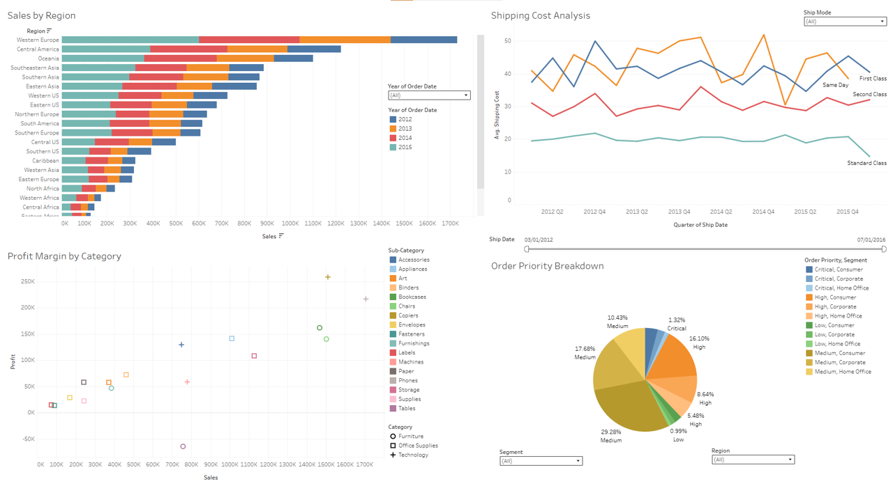

# Tableau-Projects

# 📊 Global Superstore Dashboard – Tableau Project

Create an interactive Tableau dashboard using the Global Superstore dataset, featuring **four distinct visualisations** to provide insights into sales performance, profitability, shipping costs, and order priorities.

---

## 📥 Data Preparation

- Imported the Global Superstore dataset into Tableau.
- Reviewed and corrected data types (e.g., dates, categories, numbers) for accurate analysis.

---

## 📈 Visualizations

### 1. **Sales by Region**
- **Type**: Bar Chart
- **Insight**: Total sales across different regions.
- **Features**:
  - Sorted by total sales (descending).
  - Interactive **year filter** using `Order Date`.

### 2. **Profit Margin by Category**
- **Type**: Scatter Plot
- **Insight**: Profit vs Sales for each product category.
- **Features**:
  - Colour-coded by product category for quick comparison.

### 3. **Shipping Cost Analysis**
- **Type**: Line Chart
- **Insight**: Average shipping cost trends over time.
- **Features**:
  - Filter by **Ship Mode** to explore delivery method impact.

### 4. **Order Priority Breakdown**
- **Type**: Pie Chart
- **Insight**: Distribution of orders by priority level.
- **Features**:
  - Percent of total calculated using a **table calculation**.
  - Filters for **Segment** and **Region**.

---
# Global Superstore Dashboard

[View in Tableau Public](https://public.tableau.com/views/Global_Superstore_Dashboard_17416893219880/Dashboard1?:language=en-GB&:sid=&:redirect=auth&:display_count=n&:origin=viz_share_link)
---

## 🧩 Dashboard Design

- Combined all four visualisations into a **single interactive dashboard**.
- Linked filters across views for a unified user experience.
- Focused on clean layout and user-friendly design:
  - Consistent colour scheme
  - Clear titles and legends
  - Responsive filter actions

---

> 💡 This project showcases intermediate Tableau skills in data visualisation, dashboard design, and interactive analytics.
